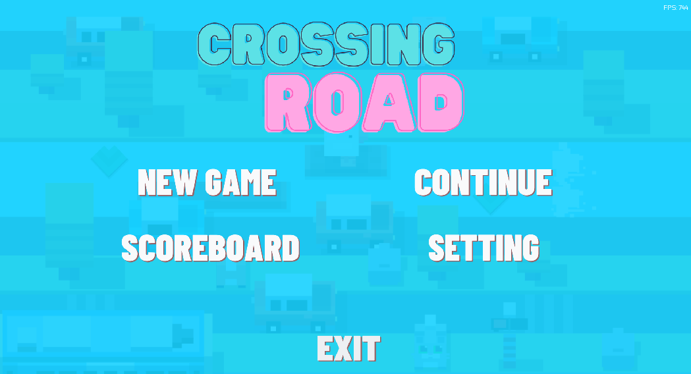
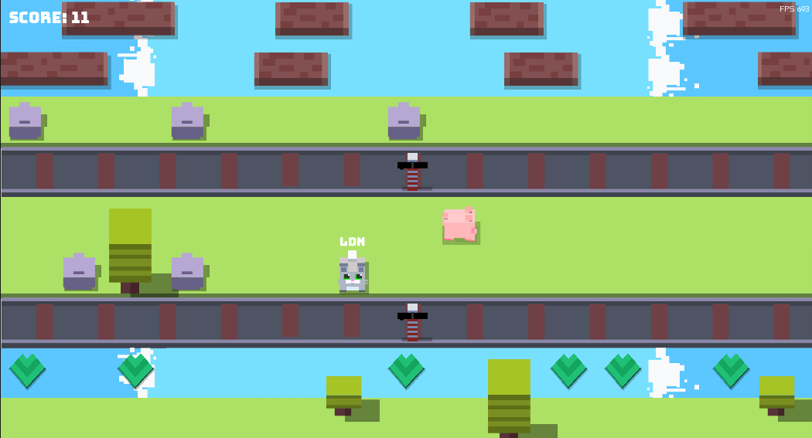

# Crossy Road - A CS202 Project

## Introduction



This is a project for CS202 course at Ho Chi Minh City University of Science (HCMUS). The project is a clone of the popular game Crossy Road. The game is made using C++ and SFML library. The game is made by a team of 4 members. The team members are:

- 22125003 - 22TT1 - [Tran Cong Lam Anh](https://github.com/lamanh-lavain)
- 22125065 - 22TT1 - [Nguyen Quoc Nghia](https://github.com/quocnghia32)
- 22125070 - 22TT1 - [Le Duc Nhuan](https://github.com/ldn694)
- 22125079 - 22TT1 - [Nguyen Minh Quan](https://github.com/nmquan22)

## How to play



The game is simple. The player has to cross as many roads as they can. The player can move up, down, left, right using the arrow keys or WASD keys. However, the player has to avoid the vehicles, the river and other animal walking by. One wrong touch and the game is over. It has 3 difficulties: Easy, Medium and Hard. The higher the difficulty, the faster the vehicles move. The player can also choose to play as different animals. Each animal has different speed and size. There is also random rain appearance in the game. The rain will make the game harder as it will make the screen blurry and reduce player's speed by 30%. The player can pause the game by pressing ESC key. Beside 1-player mode, the game also supports 2-player mode, in which 2 players compete until one player dies in the game. Key bindings and music/sound volume can be changed in the settings. The game also has a leaderboard to keep track of the top 5 highest score of each difficulty.

## How to build

The game is built using CMake. To build the game, you need to have CMake installed. Then, run the following commands:

```bash
cmake -B build -DCMAKE_BUILD_TYPE=Release
cmake --build build --config Release
```

## Project Architecture

##
